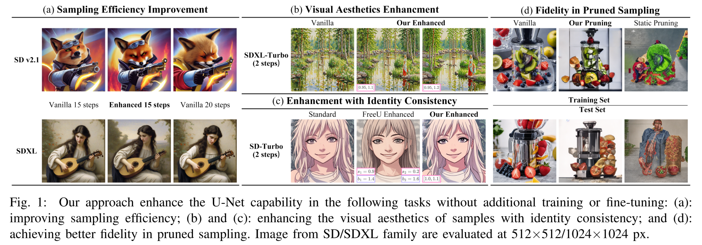

# Dynamic Importance in Diffusion U-Net for Enhanced Image Synthesis

[Xi Wang](https://hytidel.github.io/), Ziqi He, [Yang Zhou](https://zhouyangvcc.github.io/)$^\dagger$​

[Paper (including Appendix)](https://drive.google.com/drive/folders/1c01J3lUK-m5UZYaF35THWxCBgg50C0IV?usp=sharing) | [arXiv (main paper only)](https://arxiv.org/abs/2504.03471) | [Code](https://github.com/Hytidel/UNetReweighting)


# Overview



---

# 💻 Installation

😀The installation is tested with NVIDIA Driver `550.67` , CUDA `11.8` and `setuptools==75.1.0` in Ubuntu `22.04.5 LTS`. 

[1] Clone our repository from Github by HTTPS: 

```shell
git clone https://github.com/Hytidel/AttnReweighting.git
```

​	or SSH: 

```shell
git clone git@github.com:Hytidel/AttnReweighting.git
```

[2] Create a conda virtual environment with Python 3.10 and activate it. 

```shell
conda create -n UNetReweighting python=3.10
conda activate UNetReweighting
```

[3] Install versions of `torch` and `torchvision` compatible with your CUDA version. Here we install `torch==2.3.1` and `torchvision==0.18.1` for example. 

```shell
pip install torch==2.3.1 torchvision==0.18.1
```

[4] Install the dependencies. 

```bash
pip install -r requirement.txt
```

# 🏞️ Models \& Checkpoints

[1] Download the [SD-Turbo](https://huggingface.co/stabilityai/sd-turbo), [SDXL-Turbo](https://huggingface.co/stabilityai/sdxl-turbo), [SD v2.1](https://huggingface.co/stabilityai/stable-diffusion-2-1-base) and [SDXL](https://huggingface.co/stabilityai/stable-diffusion-xl-base-1.0) models from HuggingFace, and update the `pipeline_path` in `config/pipeline/*.yaml` to the directory where you have stored these models. 

​	For example, 

```yaml
# !./config/pipeline/sd-turbo.yaml

pipeline_path: /root/autodl-tmp/stabilityai/sd-turbo
```

[2] Download the checkpoints for [Human Preference Score v2](https://huggingface.co/spaces/xswu/HPSv2/resolve/main/HPS_v2_compressed.pt) and [LAION/CLIP-ViT-H-14](https://huggingface.co/laion/CLIP-ViT-H-14-laion2B-s32B-b79K), and update the `hpsv2.hps_model_ckpt_path` and `hpsv2.ViT_model_ckpt_path` in `config/task/cal_metric/run_cal_hpsv2.yaml`. 

​	For example, 

```yaml
# !./config/task/cal_metric/run_cal_hpsv2.yaml

hps_v2:
  hps_model_ckpt_path: /root/autodl-tmp/zhwang/HPDv2/HPS_v2_compressed.pt
  ViT_model_ckpt_path: /root/autodl-tmp/laion/CLIP-ViT-H-14-laion2B-s32B-b79K/open_clip_pytorch_model.bin
```

[3] Download the [Human Preference Dataset v2](https://huggingface.co/datasets/ymhao/HPDv2), and update the `prompt.prompt_json_path` in `config/task/do_importance_probe/t2i/*/run.yaml` and `config/task/sample/t2i/*/run.yaml`. 

​	For example, 

```yaml
# !./config/task/do_importance_probe/t2i/sd-turbo/run.yaml

prompt: 
  prompt_json_path: "/root/autodl-tmp/zhwang/HPDv2/benchmark/anime.json"
```

# 🛠️ Usage

😄We provided some scripts in `script/` for you to run the specified tasks conveniently. 

---

# 🙏 Acknowledgement

Our code is built upon [Human Preference Score v2](https://github.com/tgxs002/HPSv2). We would like to thank the authors for their excellent works. 


# 🥰 Citation

If you find our work helpful, please consider citing: 

```
@article{wang2025dynamic,
  title={Dynamic Importance in Diffusion U-Net for Enhanced Image Synthesis},
  author={Wang, Xi and He, Ziqi and Zhou, Yang},
  journal={arXiv preprint arXiv:2504.03471},
  year={2025}
}
```

# 🏷️ License

This repository is released under the MIT license.

